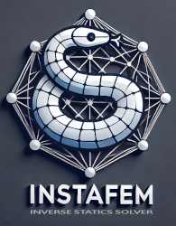

INSTAFEM is a library for solving INverse STAtics problems using the Finite Element Method. The development has just started in late 2024, and there is still much work to do.
The library uses optimization to identify the value of a set of loads so that some nodes have certain prescribed displacements. The optimal set of loads is chosen based on an objective function, that can be for example minimizing the sum of squares of the unknown forces, or the sum of their absolute values. Standard external loads and boundary conditions can also be imposed.

At the current state of development, the finite element solver supports linear tetrahedral elements, nonlinear springs, node-to-node contact and geometric nonlinearity. Basic examples describing how to create and run such simulations are provided. Additional features (hexahedral and beam elements, quadratic elements, surface-to-surface contact, etc.) are planned for future developments.

The inverse statics solver based on optimization is a work-in-progress - so far, the DIRECT optimization algorithm and bayesian optimization (botorch == 0.10) have been implemented but still require testing.

INSTAFEM aims to become a tool for musculoskeletal simulation, allowing for the calculation of muscle forces as well as full stress analysis of bone and joints.
